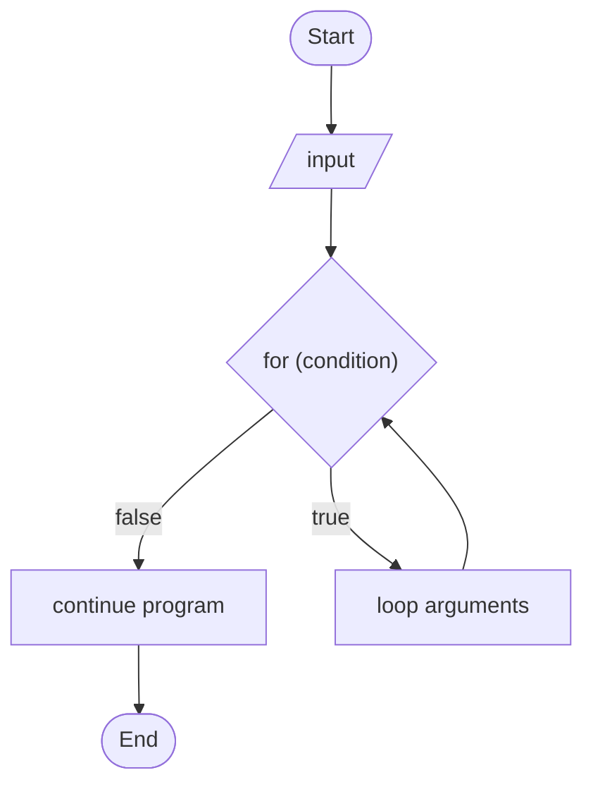
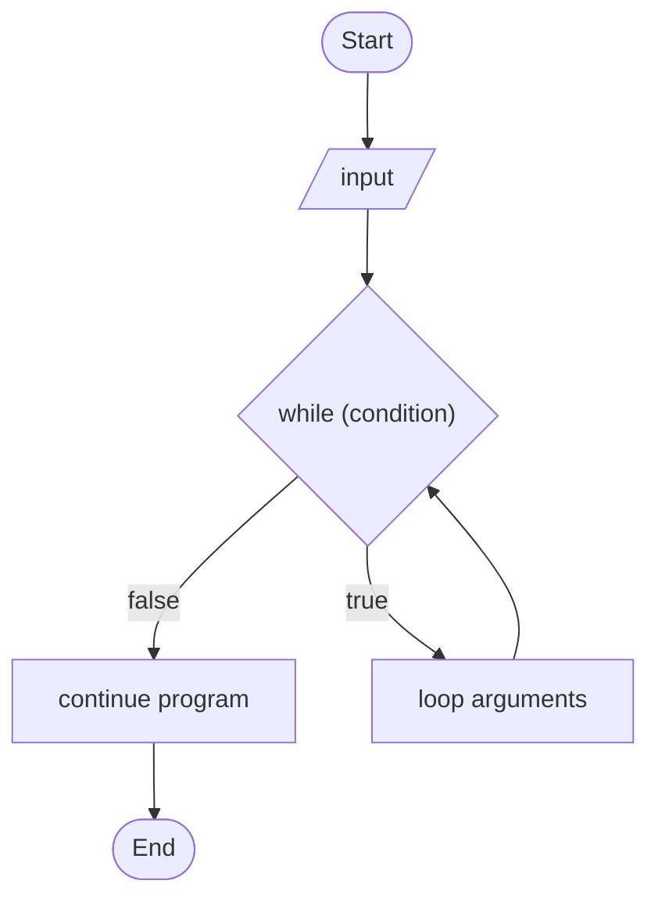
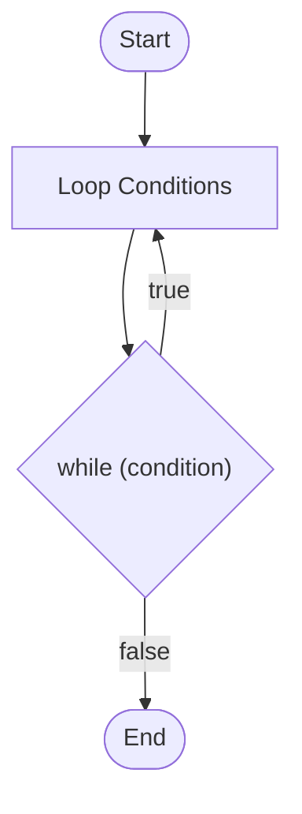

# Loops
In code, we have 3 main types of loops:
- For … do
- While … do
- do … while

The amount of times a loop iterates can be controlled by [[Logical Operators]]. This is the *condition* that causes the loop to *terminate*. Always ensure a loop will terminate – otherwise you can create a memory-leak or have a user repeating the same action infinitely. 
## For Loops
```java
bool condition;
for (condition) {
	System.out.println("Hello world!")
}
```

For loops can be used whenever we have a set number of times we need to iterate through a loop. 



## While Loops
```java
bool condition;
while (condition) {
	System.out.println("Hello world!")
	condition++
}
```
While loops can be used to iterate whenever we don’t know how many times the loop needs to be iterated through. 


## Do Loops
```java
do 
loop arguments
while (condition)
```
Do loops can be used when we have to iterate through a piece of code at least once, whether or not the condition is true. 

