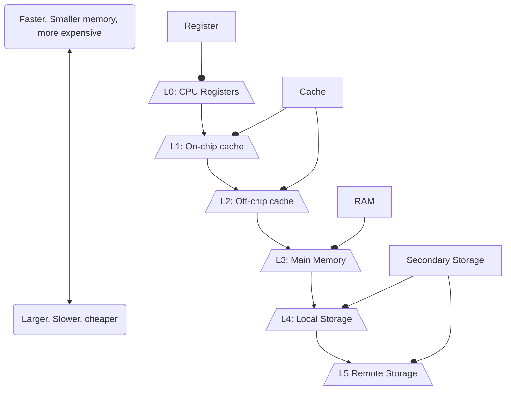
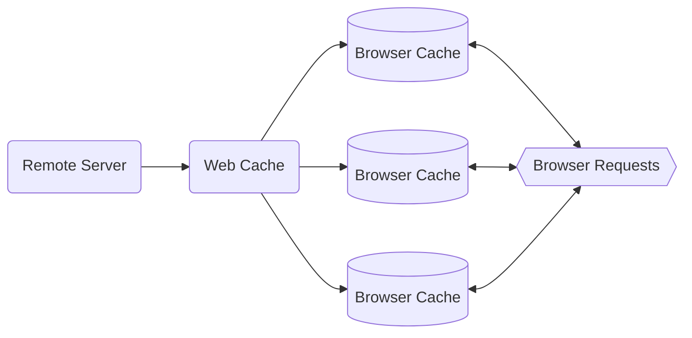

# Cache and Latency
Latency is the delay of information moving from storage to processing. This limits the speed of a system, and causes slowdowns. A processor with low latency storage will appear faster than a processor with high latency storage. Cache is a way to store commonly used or upcoming data that reduces latency. The basic idea of cache is to store data in faster memory as it is likely to be used.  ^blurb

All forms of storage can be seen as different types of caches. This is denoted by $L(n)$ , where $n$ denotes the read-priority of a cache (the order that it is read in). 

### Types of Cache
Caching happens wherever there is place for data to be stored faster. 
There are many types of cache, we look at:
- Disk cache
- Browser Cache
- Web Cache

#### Disk Cache
Disk cache is a hardware mechanism where data is stored into faster memory to increase read speeds. This can be done with memory built into the hard drive, or with RAM.

#### Browser Cache
Browsers will keep a copy of a website locally to speed up further access to the website. Downloads and cookies are also a part of browser cache. This speeds up further accesses of the same website, as all the website data doesn’t need to be reloaded. 

#### Web Cache/Proxy Server Cache
Web cache is where a proxy server within an organisation stores a copy of a commonly accessed site to reduce load times and web traffic. This is private storage that is managed by an organisation for the members of it’s network. This can lead to the site being out of date. 

## Latency
**Definition**: How much time the memory delays in giving the data that the [[CPU]] asks for ^latency-definition

**Unit of Measure**: ms

## Speed and Throughput of System Components
Speed refers to the rate of transfer of data in of system components. For different components the speed is measured in different increments. For instance: the [[CPU]] works in GHz and the [[RAM]] in MHz. This is the *maximum possible data throughput* of the component. Often, this throughput is not possible due to [[#Latency]]. This is also referred to as the *bandwidth* of the component.

Throughput is the actual speed that data can be transferred, with [[#Latency]] taken into account. These terms are the same as in [[Computer Networks]]. 