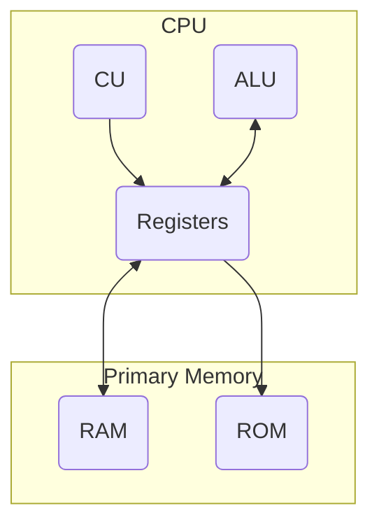
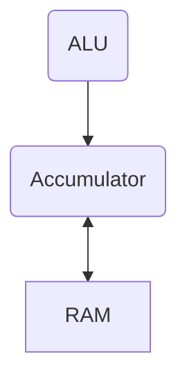
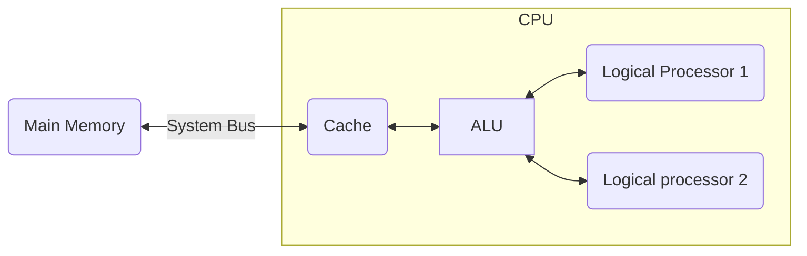
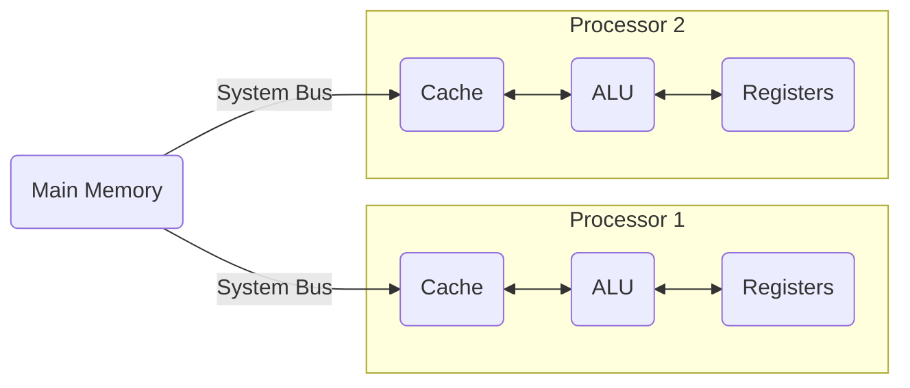

# Central Processing Unit
The CPU is the primary processor of the whole computer. Most logical operations start here. ^blurb

## Components of the CPU
The CPU consists of:
- Arithmetic and Logic Unit (ALU)
- Control Unit (CU)
- Registers

### Arithmetic and Logic Unit (ALU)
The ALU an electronic circuit that performs simple arithmetic operations through *logic gates*. 

It can only add numbers, and performs other operations only using addition. To subtract, the ALU will add negative numbers. To multiply the ALU will repeatedly use addition and to divide the ALU will repeatedly add negative numbers. 

Logic gates run [[Logical Operators]] and determine if they are true or false. 

Once something has been processed in the ALU it will be sent to memory for storage. To do this, the instruction processed is broken down into parts and stored in registers. The accumulator is the specific register meant to store the result of an execution of an instruction. Saved data moves from the accumulator to RAM, and loaded data comes from the RAM into the accumulator.

### Control Unit (CU)
The CU will coordinate the instructions sent to the processor to ensure they are efficiently processed. It sends the read/write signals to RAM and ROM through a control bus. This allows it to read or write addresses in memory or in [[#Registers]]

### Registers
Registers store small bits of data that the CPU is working on. They can contain a memory address or data itself. They can also point to other registers as part of their instructions. 

Registers are made of SRAM, which is very fast but very expensive. It does not contain capacitors, and dous not need to be refreshed.

There can be 32bit and 64bit registers, which determines the size of groups of data. A 32bit register can process 64bit data, but it takes two stages to do so, meaning a 64bit register will be faster for 64bit instructions. However, 64bit code has a higher memory consumption that will cause more reads on slower primary memory (RAM). 

## Series and Parallel Processing
When they were developed, CPU’s had one core where instructions could be processed. They broke down a problem into instructions and handled each instruction sequentially. This is known as *serial processing*

Parallel processing also breaks up a problem into instructions, but then the load of processing those instructions is spread amongst multiple cores. This also allows multiple programs to run at once, with each running on it’s own processor. 

### Multi-threading
Before parallel processing was feasible, computer scientists saw a way to optimize single-core processors. They had a lot of downtime where they were waiting on the next instruction to load from memory. To accelerate this loading, they decided to duplicate the registers on the chip, allowing processors to pre-load more instructions and therefore reduce wait time. 
### Hyper-threading: the first parallel processors
In 2002 Intel tried something new: they got their CPU’s to execute two sets of instructions at the same time. Each instruction became a “thread” contained within a program. It allowed one CPU to split it’s resources amongst two ‘digital’ ALU’s. This means that it can handle two separate streams of information at once, such as two programs or two threads, which reduced the amount of *state changes* (all the values related to a program), and therefore increased the speed of *context switching* (changing from one thread to another). 

> hyperthreading

Hyperthreading is a hardware-based technology, but the [[operating system]] must take advantage of the two logical cores. Otherwise, the two cores will be used like one. 
### Multiprocessing
Multiprocessing uses multiple CPU’s. Similar to multi-threading, this lets many processes run at the same time, but the registers are not shared between each core. This is advantageous as it increases the amount of register space, as well as the amount of processing capability. However, both the operating system and the motherboard need to support this technology. 

You can combine multiprocessing and hyperthreading to increase the total number of logical cores, without increasing the needed amount of physical cores on the device. 