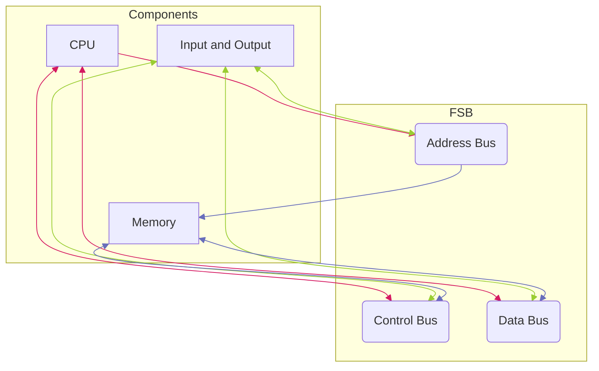

# Motherboard
The motherboard consists of a printed circuit that connects components. This is done through slots, ports, and busses that connect components and transfer data. All data transfers and system functions are synchronised by a clock generator that exists on the motherboard. ^blurb

## The System Clock
There is a microchip on the motherboard that regulates the timing of system functions. Within this chip is a crystal that vibrates at a specific frequency when stimulated by electricity. This dictates the shortest amount of time that any system operation can complete, which is called one clock, and is equal to one vibration of the crystal. 

### Overclocking
Overclocking is the process of making computer components work faster than they were initially meant to. This is done by increasing the frequency that the component runs at. This can be done in one of two ways:

- **Overclocking per Component** – The [[CPU]] changes it’s *clock multiplication factor* so that it runs faster than the system clock
- **Overclocking the whole system** – The speed of the system clock is increased, increasing the speed of all components. 

## Busses and Data Transfer
Data is transferred between components by means of busses. The main bus that connects [[CPU]] and [[RAM]] is known as the Front Side Bus (FSB). Any other components are connected by *external busses* in modern computers, such as PCIE or SATA connections. 

### FSB: Front Side Bus
The FSB connects the CPU and RAM through a series of other busses, known as the control bus, address bus, and data bus. 

The Data bus transfers actual instructions between the CPU and the RAM. It is normally a wide bus, meaning it has a higher [[Cache and Latency#Speed and Throughput of System Components|bandwidth]]. This increases throughput, and therefore the amount of data that can be transferred to the CPU. The number of bits the data bus can transfer has an influence on the amount of [[CPU#Registers|register]] space that the CPU needs. 

The Address Bus transfers the physical address of instructions between memory and a processor. When a processor is looking to read or write memory, it specifies where it should be written in the address bus. A larger memory bus determines the amount of RAM a system can address, meaning that a small address bus can have less RAM than a large address bus. 

The control bus carries commands between CPU and RAM, sending read/write signals back and forth. 

### External Busses
There are many kinds of external busses available. They connect to devices other than the CPU or RAM, and allow configuration within a system. 

The busses we look at are:
- PCIE slots
- SATA busses
- USB
- NVMe busses
- M.2 busses

#### PCIE Slot
Peripheral Component Interchange Express slots are used to connect graphics cards, wifi cards, SSD’s, or RAID cards to the motherboard. The amount of these slots depends on the motherboard. 

#### SATA Busses
Serial Advanced Technology Attatchment busses were meade to connect mass storage devices, such as hard drives, to the motherboard. SATA busses have had 3 generations, and are backwards compatible (with a speed loss). 

#### USB
Universal Serial Bus technology was made to connect any peripheral with the system, and allow power and data transfer. It was meant to standardize the connection used for these devices. 

#### NVMe Busses
Non-Volatile Memory Express busses are a communication bus that connects SSD’s to the motherboard with high read/write speeds. 

#### M.2 Busses
M.2 busses are meant to replace large, bulky, and slow SATA busses. They are made to install high-speed devices with low power requirements into small spaces. M.2’s can use the NVMe, SATA, PCIE, or USB 3.0 busses. 

