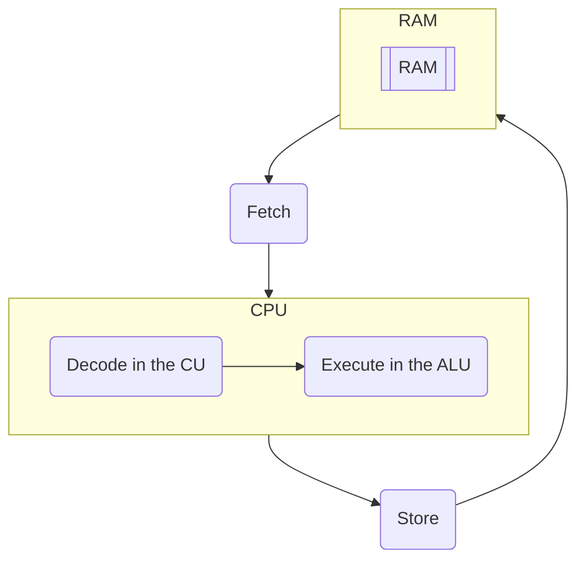

# Machine Cycle
For each instruction the [[CPU]] must calculate, it must undergo a number of processes. This is done in 4 stages, Fetch, Decode, Execute, and Store.  ^blurb

- **Fetch**: A process is loaded into the CU
- **Decode**: The process is understood by the CPU’s instruction set
- **Execute**: The instruction is run by the ALU
- **Store**: Send the result of the instruction back to the 

The registers on the CPU only stores the data the CPU is actively working with. The [[CPU#Control Unit (CU)|CU]] is responsible for sending the read/write signals back and forth from the RAM and the CPU. 