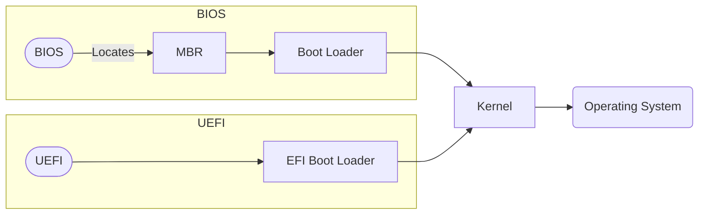

# Startup and Boot Software
When a computer is switched on, the computer undergoes hardware checks before loading the [[operating system]]. These hardware checks identifies and checks every hardware component attached to the computer. This is done by the [[#BIOS]], which also starts the [[#Boot Loader]]. The BIOS knows what components to check by checking the [[#CMOS]], where hardware settings are stored. ^blurb

## BIOS (Basic input Output System) and UEFI (Unified Extended Firmware Interface)
The BIOS is a low-level software that resides on the [[ROM]] of a computers. It is a type of [[firmware]]. UEFI is also a type of firmware meant to build on top of BIOS’s functions. It is a newer, more efficient way of achieving the same thing that BIOS does. 

During startup, both BIOS and UEFI:
1. Performs the POST (Power-On Self Test)
2. Reads the CMOS (Complementary Metal-Oxide-Semiconductor) for a list of hardware components
3. Tests the hardware to determine if it is all functioning correctly

However, as the computer starts, the BIOS locates the MBR (Master Boot Record) which leads and executes the operating system kernel through the boot loader. UEFI however simply loads the kernel, skipping the bootloader. 

UEFI also has other benefits. It skips the limitations of the BIOS, meaning it can boot from drives larger that 2.2TB, and can run in 32-bit or 64-bit mode (speeding up the boot process), and the UEFI can be more user-friendly as it is more extensible. 

Additionally, UEFI supports secure boot which checks the operating system and boot process for malware. It can also support networking features, which allows for remote troubleshooting and configuration. Lastly, it can be run from a [[Secondary Storage|hard-drive]] or a network share, allowing it to be very portable. 

## System kernel
The system kernel is the core of an operating system. It always remains in ram, and is responsible for translating software requests into CPU instructions. It also handles memory management, and peripherals.

## CMOS
CMOS is a volatile memory that has it’s own dedicated battery on the motherboard. It stores hardware configuration and user settings that can be seen in the BIOS. It is volatile so it can be overwritten easily. 

