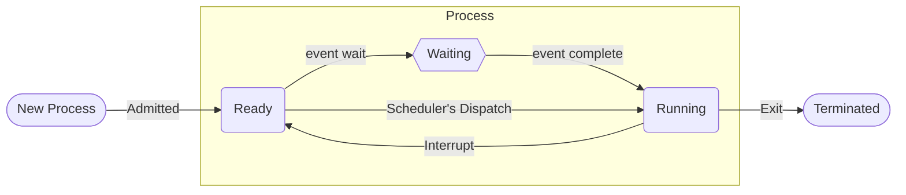

# System Interrupts
A running process sends multiple instructions to the cpu to perform it’s functions. Each process has a status associated with it: suspended, ready, or running. ^blurb

When a process is waiting for *input, it is suspended*. When this *input comes, then the status changes to ready or running*. Before a process can be run it *needs all of the data* and instructions it needs to give to the CPU. A process only *changes to running when it is being processed* by the CPU. 

Each process has a *process control block* and a *position in the scheduler* associated with it. The process control block contains the data and instructions that the processes need to run. When the status of the process changes from suspended to ready, the task *scheduler checks the position* in the process cue and sends the process to the CPU when it is free. 

The scheduler is run by the operating system. It sends a signal to the CPU called an interrupt, which which indicates that the CPU needs to give the process attention. Interrupts are generated constantly as the CPU needs to process new tasks. This allows it to pause what it is processing and switch to a new process, without necessarily running one to completion. 

## Software Interrupts
Software interrupts occur when I/O requests or errors are found in processes. It can also occur when a process has used up it’s allotted cycles on the CPU timer.

## Hardware Interrupts
When a signal is sent from a device, it generates a hardware interrupt. This stops the task the CPU is processing and begins the execution of an interrupt handler program meant to react accordingly to the instruction. The handler has priority levels assigned to each interrupt request, and will handle them in the order of this priority. 

### IRQ’s (Interrupt Request Number)
Each device has a unique IRQ that identifies it. 

### IO Range
There is a small space in the [[RAM]] meant to speed up slow hardware devices by assigning them a cache area. This space is used for loading, editing, and writing files. Instead of reading a file line-by-line, it is read into the IO range. This reduces the amount of CPU cycles used to read and write a file, as it does not need to pull from slow [[Secondary Storage]] each time an edit must occur. Once a file is written, the buffer is flushed and cleared for future processing requests. 