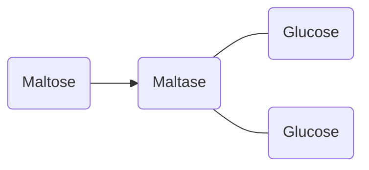
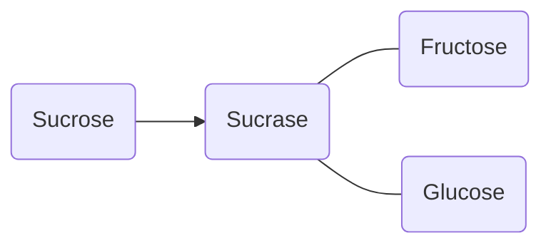
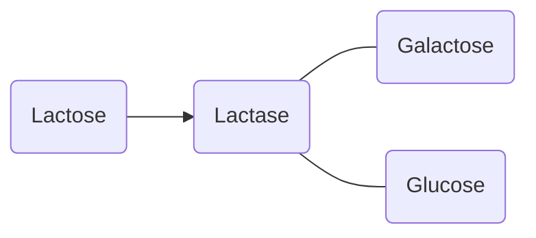

# Carbohydrates
Carbohydrates form the basis of energy within organisms. [[Autotrophs]] produce carbohydrates through [[Photosynthesis]], which is then ingested and processed by [[Heterotrophs]].  ^blurb

## Production of Carbohydrates
Carbohydrates are produced by [[Autotrophs]] through [[Photosynthesis]]. 

![[Photosynthesis#Products of Photosynthesis]]

## Structure of Carbohydrates
When dealing with carbohydrates, we look at three levels of complexity: Monosaccharides, Disaccharides, and Polysaccharides. These bond together by means of glycosidic bonds

> [!info] Extra: Chemical Structure of a Carbohydrate
> ![[Carbohydrate Structure.png]]
> 
> Structure of a Carbohydrate monomer

### Monosaccharides
The building blocks of all carbohydrates are *monosaccharides*, meaning small one ring-structures (-saccharide means ring-structure).  are sweet and soluble, and they are all *Isomers*, meaning they have the same molecular structure of C6H12O6. 
There are three types of carbohydrates:
- Glucose ^a93ecb
- Fructose (Fruit sugar)
- Galactose (Milk Sugar)

### Disaccharides
All disaccharides consist of two monosaccharides bound together. They are sweet and soluble, and they are are Isomers on one another with the molecular structure of C12H22O11, as one H2O molecule is removed when a bond is formed. This bond is called a *glycocidic bond*. 
There are three disaccharides, and all of them contain glucose and another monosaccharide.
- Glucose + Glucose → Maltose (Malt Sugar)
- Glucose + Fructose → Sucrose (Cane Sugar)
- Glucose + Galactose → Lactose (Milk Sugar)

$$ 
\textrm{Glucose} + \textrm{Glucose} ⇌ \textrm{Maltose} \textrm{ (done by maltase)}
$$

$$
\textrm{Glucose} + \textrm{Fructose} ⇌ \textrm{Sucrose} \textrm{ (done by sucrase)}
$$

$$
\textrm{Glucose} + \textrm{Galactose} ⇌ \textrm{Lactose} \textrm{ (done by lactase)}
$$

### Polysaccharides
Polysaccharides are *macromolecules* that consist of thousands of interconnected *monomers*, usually glucose. They are not soluble and not sweet
There are many types of polysaccharides, such as:
- Starch
- Glycogen
- Cellulose ^570345