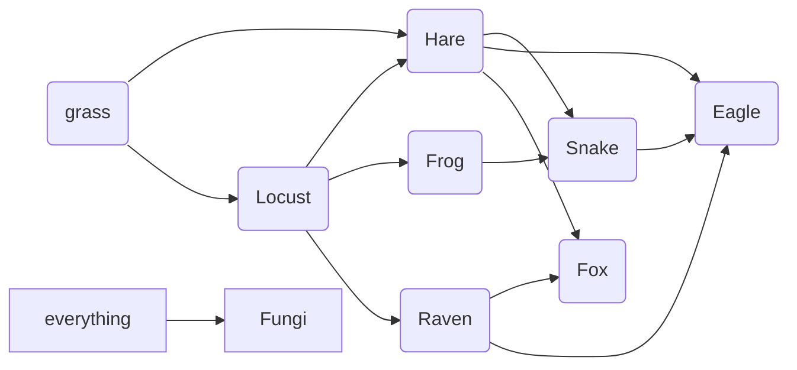
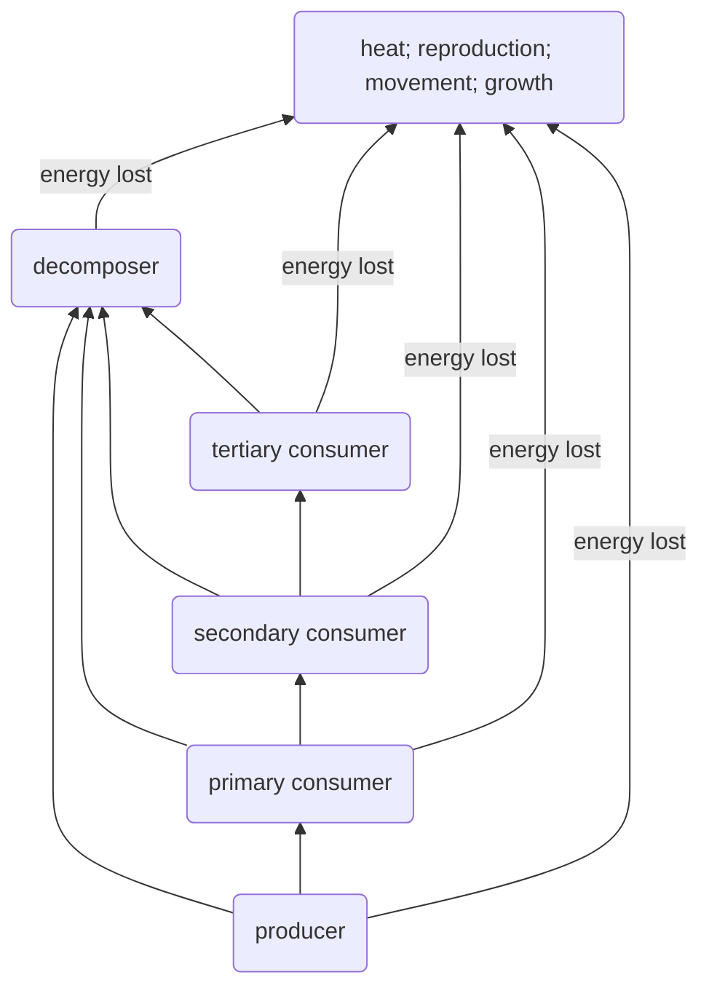

# Energy Flow
Energy flows in all [[ecosystems]] through its organisms. We can understand this flow through *food chains* and *food webs*, or through *tropic levels*. This allows us to understand the connections between organisms, and the relationships that exist in nature. ^blurb

> [!info]- Case Study: Wolves in Yellowstone National Park
>
> This infographic talks about the effects that simply reintroducing the previously-killed wolf population of Yellowstone national park has now strengthened the entire ecosystem
> ![[Trophic Cascade Case Study.png]]

## Food Chains and Webs
Food chains and webs allow us to understand the different places where energy is transferred in an ecosystem. We use arrows to show the direction of energy flow. 

For instance, if we look at a garden we can see the following food chain:

This can also be shown as a food web:

From here we can understand the effects that removing a species from an ecosystem would have. As one population increases, it’s predator species would increase and it’s prey species would decrease. 

## Trophic Levels
Energy flows in [[ecosystems]] through the *trophic levels*. Trophic levels are the levels at which feeding occurs in an ecosystem. 

Trophic levels consist of:
- [[Autotrophs|Producers]] – the first level with the greatest amount of energy available because it produces it’s own energy. 
- *primary consumers* – the second trophic level formed of [[Heterotrophs|herbivores]] and [[Heterotrophs|omnivores]] that feed on producers. They have less energy available to them than producers.
- *secondary consumers* – the third trophic level formed by [[Heterotrophs|carnivores]] and [[Heterotrophs|omnivores]] that feed on primary consumers. They have less energy available to them than primary consumers.
- *tertiary consumers* – the fourth trophic level formed by [[Heterotrophs|carnivores]] that feed on other carnivores. They have less energy available to them than secondary consumers.
- *decomposers* – the fifth trophic level formed by [[Heterotrophs|saprophytes]] which decompose all living matter and release heat and other byproducts back into the environment. 

At each trophic level energy is lost by heat, movement, growth, or reproduction. However this energy is released into the ecosystem through heat during decomposition. 

we can show trophic levels in many ways, one such way is a [[#Food Chains and Webs|food chain]]. 

We can also use the [[Ecological Pyramids]] to show trophic levels and energy loss. 

## Bibliography
[Infographic: Wolves Keep Yellowstone in the Balance | Earthjustice](https://earthjustice.org/features/infographic-wolves-keep-yellowstone-in-the-balance)