# The Carbon Cycle

```mermaid
flowchart TD

carbonDioxide("CO<sub>2</sub> in the Atmosphere")

fossilFuels(Fossil Fuels)
plants("Plants 🥬")
animals("Animals 🐄")

combustion{{"Combustion 🔥"}}
decomposition{{"Decomposition 🍄"}}
respiration{{"Respiration 🌬"}}

photosynthesis{{"Photosynthesis in plants"}}



combustion & decomposition & respiration --> carbonDioxide
carbonDioxide --> photosynthesis
photosynthesis -- creates food for --> animals
photosynthesis --> plants
plants & animals -- respiration --> carbonDioxide
plants & animals -- death --> decomposition
plants & animals -- death and fossilisation --> fossilFuels
fossilFuels --> combustion
```

Carbon is found in the atmosphere, as well as in [[Carbohydrates]] and other [[Organic and Inorganic Compounds]]. In the atmosphere, it is found as CO2, and it can also be dissolved in water.

## Uses of Carbon
Carbon is used in [[Plastids|photosynthesis]] to create [[Carbohydrates]], which in turn serves as food for the entire [[Ecosystems|ecosystem]]. 

Carbon is an essential part of [[Photosynthesis]] and the [[The Oxygen Cycle]], as plants break Carbon Dioxide down into Carbon for Carbohydrates, leaving Oxygen as a biproduct which is released into the atmosphere through [[Transpiration]]

### Fossilisation of Carbon 
When Plants and animals die, their bodies are either decomposed or they are covered by [[erosion|sediments]] and are compacted into *fossil fuels*. This is later released into [[The Atmosphere]] by [[The Carbon Cycle#Return of Carbon to the Atmosphere|Combustion]]. 

## Return of Carbon to the Atmosphere
Carbon returns to the atmosphere through 3 different ways:
- [[Respiration|cellular respiration]] in living organisms
- [[Energy Flow|Decomposition]] of deceased organisms
- Combustion of deceased organism

## Link to the Oxygen Cycle
The carbon cycle is linked to the [[The Oxygen Cycle]] through [[Photosynthesis]], as Carbon Dioxide is broken into *carbon* and Oxygen in plants, linking the two cycles. The Carbon goes into [[Carbohydrates]] while the Oxygen is released into [[The Atmosphere]] through [[Transpiration]]