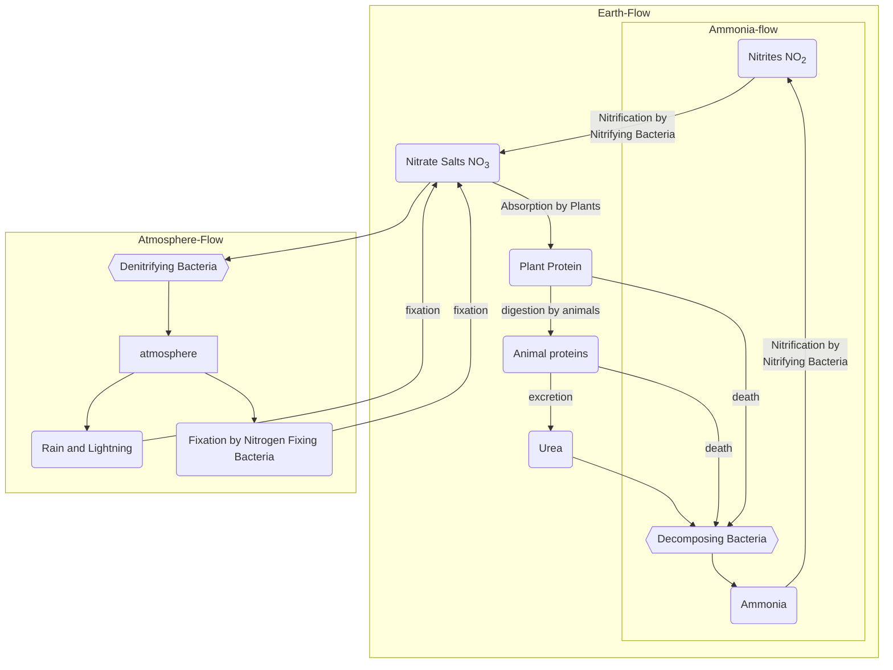

# The Nitrogen Cycle
Nitrogen is found in [[The Atmosphere]]. Nitrogen is necessary for all organisms – it is one of the essential components of [[Proteins|Amino Acids]]. However, no organism can absorb it directly from the [[The Atmosphere|atmosphere]]. 

## How Nitrogen Is used
The N2(g) undergoes *Fixation*, either by rain and lightning or by *Nitrogen Fixing Bacteria*, which turns the N2(g) into *Nitrates (NO3)*, which can be found in the soil. 

### Nitrogen-Fixing Bacteria
Nitrogen fixing Bacteria are found in the soil as *free-living bacteria*. Some Nitrogen-fixing bacteria are found living mutualistically in the root nodules of leguminous plants (such as peas and beans). These absorb the Nitrogen gas and convert it into *Nitrates*. 

### Usage By Plants
Nitrates can be absorbed by *plants* through their [[Dicotyledonous plants#Dicotyledonous Roots|Roots]] and converted into [[proteins]]. When the plant dies, their organic matter is decomposed by *decomposing Bacteria* into *Ammonia (NH3)*

### Usage By Animals
Animals will eat plants, and the proteins will filter through the [[Energy Flow|trophic levels]] to all animals before either being *excreted as urea*, or *released when the animal dies* and is decomposed. The urea is decomposed by *decomposing Bacteria* into *Ammonia (NH3)*. When the animals dies, their organic matter is decomposed by *decomposing Bacteria* into *Ammonia (NH3)*

#### Ammonia To Nitrates
Ammonia (NH3) is broken into Nitrites (NO2) by *nitrifying bacteria*. NO2 is then combined into Nitrites (NO3) by the same nitrifying bacteria. 

## Return of Nitrogen to the Atmosphere
*Ammonia (NH3)* can be broken into Nitrites (NO2), which can be made into Nitrates (NO3), which are then broken into N2(g) by *denitrifying bacteria* and re-released into the atmosphere. 

> [!info] Eutrophication and Fertilisers
>
>Fertilizers increase soil quality for plant growth, but may cause runoff water that leeches the nutrients from the soil. This water can then escape into waterbodies, which will experience an *algae bloom* due to the excessive nutrients. This is known as eutrophication.
>
>These algae will eventually cover the surface of the waterbody and use all the nutrients, leaving the water without any life or nutrients. This causes decomposition bacteria to increase in the water, using up more oxygen from the water, and killing off any remaining aquatic organisms that require this water. 
>
>This is why the excessive use of fertilisers and the dumping of waste into waterbodies is discouraged, as it can devastate the [[Ecosystems]] involved