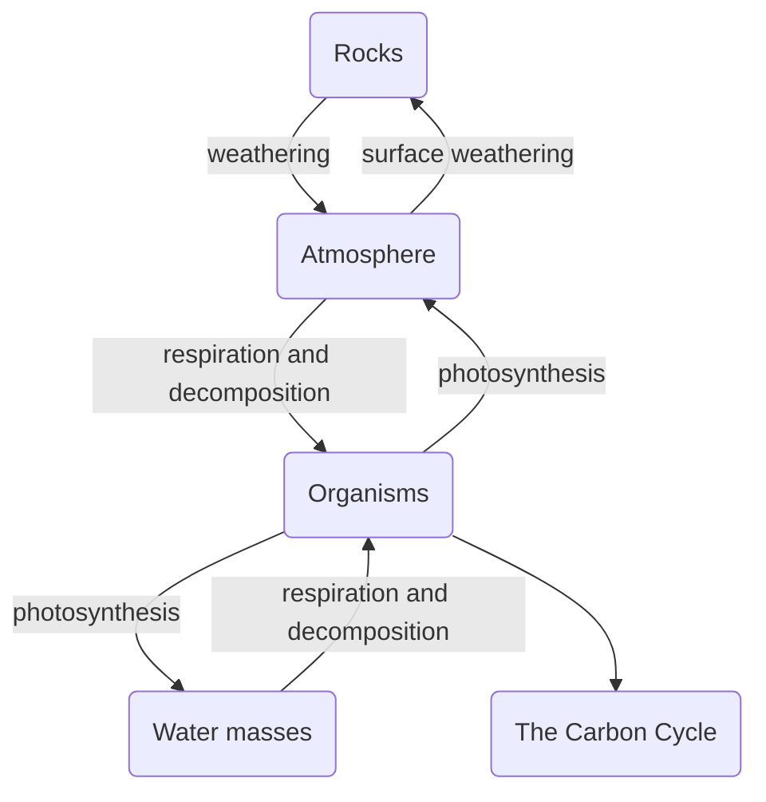

# The Oxygen Cycle
Oxygen is found in [[The Atmosphere]]. Oxygen is a vital component of [[Carbohydrates]], as well as a necessary part of [[Cellular Respiration|cellular respiration]]. However, the amount of oxygen on the earth is fixed, and as such is must be cycled repeatedly in order to maintain a balance. 

## The Cycle of Oxygen in an Environment

## Uses of Oxygen
Oxygen is used in photosynthesis by plants, and in gaseous exchange by animals. Furthermore, it is found in rocks, water, and in the atmosphere.

### Oxygen in Gaseous Exchange
Plants and Animals have developed specialised ways of absorbing oxygen, mainly through surfaces that facilitate [[Gaseous Exchange]]. Plants have developed [[Dicotyledonous plants#^stomata|stomata]] to facilitate gaseous exchange, while animals have [[Lungs]] for [[Gaseous Exchange in the Human Body|gaseous exchange in mammals]]. 

### Presence in Other inorganic Substances
Oxygen is absorbed into rocks and into water, which store water and give rise to aquatic organisms and to lichen.

### Usage of Oxygen by Decomposers
Decomposers use oxygen to break down Organic matter and release [[The Carbon Cycle|Carbon Dioxide]]

## Return of Oxygen to the Atmosphere
Oxygen Returns through the atmosphere through [[Photosynthesis]] in [[Autotrophs]], where Carbon Dioxide is used and Oxygen is a byproduct. 

Oxygen also returns through the process of [[Weathering]] of rocks that are rich in oxygen. 

## Link to the Carbon Cycle
The Oxygen cycle is linked to the [[The Carbon Cycle]] through [[Photosynthesis]], as Carbon Dioxide is broken into *carbon* and Oxygen in plants, linking the two cycles. The Carbon goes into [[Carbohydrates]] while the Oxygen is released into [[The Atmosphere]] through [[Transpiration]]