# The Water Cycle
**Definition**: The cyclical movement of water between the earth and [[the atmosphere]]. 

Water moves from the atmosphere to the earth as precipitation. This precipitation can either  join an existing water body, or it can join the *water table*. From there, it is either evaporated by the sun or transpired from plants who absorbed the groundwater, becoming water-vapor. The water-vapor will eventually cool, and condense into precipitation. 

```mermaid
flowchart 

id1(["Precipitation"]) --> id2("Water features, the water table, and plants 🏞")
id2 --> id3(["Evaporation 🌞 and Transpiration 🥬"])
id4 --> id5(["Condensation ❄"])
id3 --> id4("Water Vapor")

id5 --> id6("Clouds")
id6 --> id1
```

## Forms of water
We look at: 
- [[Precipitation]]
- Evaporation
- [[Transpiration]]
- Condensation
- Water Vapour

### Precipitation
![[Precipitation]]

### Evaporation
Evaporation is water that has been released due to [[Heating of the Atmosphere#^latent-heat|latent heat]]. It also includes water that has evaporated from any water-body. 

### Transpiration
![[Transpiration]]
![[Transport Within Plants#Transpiration Pull]]

### Condensation
Condensation occurs when water-vapor in the atmosphere cools. Most forms of condensation are included as a part of [[#Precipitation]], namely, [[Precipitation|dew]] and [[Precipitation|frost]] .

![[Precipitation#Dew and Frost]]

### Water Vapour
Water-vapour is water that is in it’s gaseous form, still in the atmosphere. 

## Absorption of Water by the Earth
The process of water being absorbed by the soil is known as *infiltration*. Water that reaches the earth is absorbed in one of two ways: Either as *Hygroscopic water*, or as *capillary water*. Water that is not absorbed stays between soil granules as *gravitational water*. 

The *water table* is where the soil is saturated by water. Hygroscopic water and capillary water both make up the water table, while gravitational water is water that has been pushed out of the water table when it is fully saturated. 

## Wetlands Role in the Water Cycle
![[Biomes#Importance of Wetlands in the Water Cycle]]