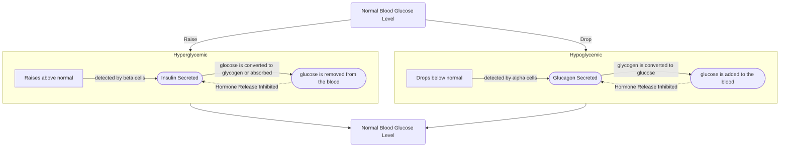

# Homeostasis
Homeostasis is the maintenance of a consistent internal environment of the human body. This means that factors like glucose concentration, water concentration, $\ce{CO2}$, concentration, $\ce{O2}$ concentration, pH, and Temperature remain constant. ^blurb

The factors that make up our internal environment and that must be kept constant are:
- Glucose concentration
- Water concentration
- $\ce{CO2}$, concentration
- $\ce{O2}$ concentration
- pH 
- Temperature 

## Hormonal Control of Glucose Concentration in the Blood
The concentration of [[Carbohydrates|glucose]] in the blood must be kept constant as if the diffusion gradient of water changes, then water will be pulled out of cells and they will die even if the body takes in lots of water. 

There are two hormones that control the concentration of glucose within the body. They are *antagonistic hormones*, meaning that they have opposite effects on the body when released. These hormones are *insulin* and *glucagon*. Their release is controlled by the *islets of Langerhans* found in the [[The Pancreas|pancreas]]. 

**Insulin** stimulates the absorption of glucose into the bodies cells and instructs the *liver and the muscles to convert glucose into glycogen*. This *lowers the glucose concentration* of the blood. The release of insulin is controlled by the *$\beta$ cells* (beta cells) of the islets of Langerhans: When *glucose concentration raises too high*, they *secrete insulin* into the blood, and when glucose returns to normal levels they inhibit the secretion of insulin. 

**Glucagon** stimulates the conversion of glucagon into glucose and the release of the converted glucose into the blood. This increases the glucose concentration of the blood. The release of glucagon is controlled by the *$\alpha$ cells* (alpha cells) of the islets of Langerhans: When *glucose concentration raises too high* they *secrete glucagon* into the blood, and when glucose returns to normal levels they inhibit the secretion of glucagon. 

Lack of homeostatic control of glucose leads to [[diabetes mellitus]]

> [!info]- Diabetes Mellitus
> ![[diabetes mellitus]]