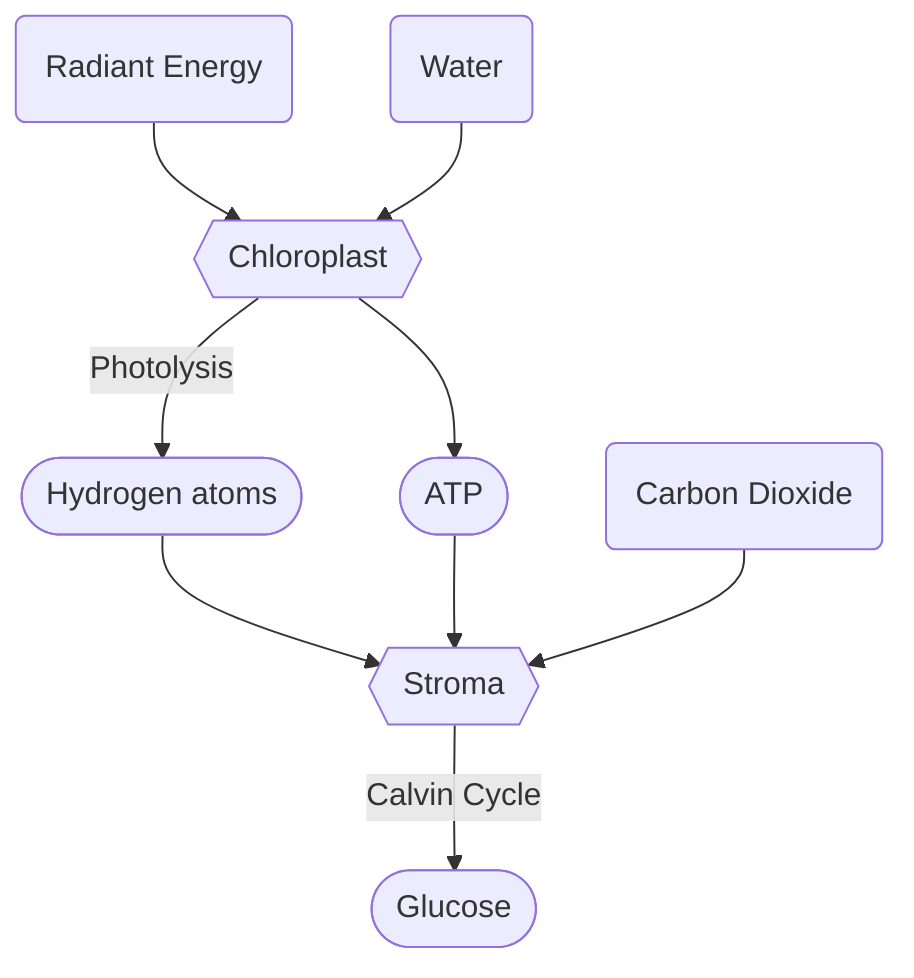
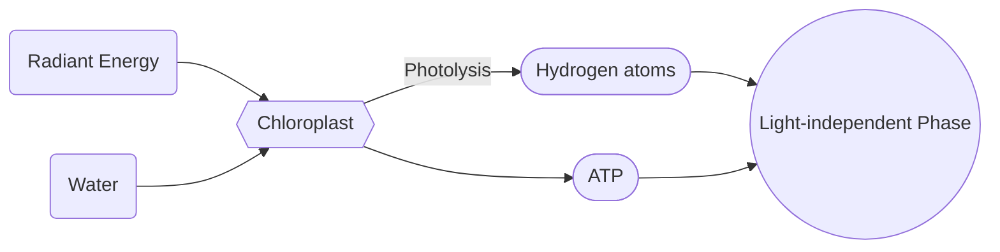
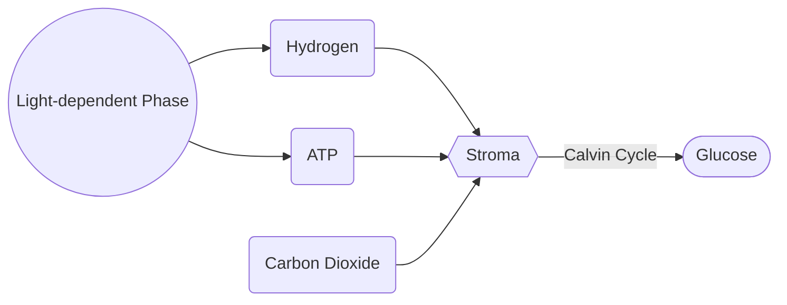

# Photosynthesis
Photosynthesis takes place in the [[Plastids|chloroplasts]] in [[Autotrophs]]. It is the process that converts carbon, radiant energy, and water into [[Carbohydrates]].

**Definition**: The anabolic process of converting Carbon Dioxide and Water into glucose and oxygen using radiant energy trapped by the chlorophyll of green plants. ^definition

**Formula**:
$$
6CO_2 + 6H_2 O  \textrm{ With Radiant Energy} \rightarrow C_6H_{12}O_6 + 6O_2
$$
## Requirements for Photosynthesis
Photosynthesis requires *Carbon Dioxide* from the atmosphere, *Water* from the soil, *Radiant energy* from the sun, *Chlorophyll* found in green leaves, and *Enzymes* to create carbohydrates. 
- $CO_2$ Carbon Dioxide
- $H_2O$ Water
- Radiant Energy
- Chlorophyll
- Enzymes

### Chloroplasts: The Vessel of Photosynthesis
![[Plastids#Chloroplasts]]

## Products of Photosynthesis
Photosynthesis produces *Carbohydrates* and *Oxygen*. Plants store the carbohydrates as starch for later use and release the oxygen into the atmosphere through the [[Epidermis|stomata]].
- $C_6H_{12}O_6$ Carbohydrates
- $O_2$ Oxygen

> [!extra]- Extra: Chemical Structure of a Carbohydrate
> ![[Carbohydrate Structure.png]]
> 
> Structure of a Carbohydrate monomer

## Process of Photosynthesis
Two phases of photosynthesis can be distinguished:
- :sun_with_face: [[#Light-dependent Phase]]
- :first_quarter_moon_with_face: [[#Dark Phase]]

The light phase can only happen when there is enough light for it to take place. This is known as *light dependant*. Whenever the light phase is not occurring, the plant is going through the dark phase. 

### Light-dependent Phase
The light phase takes place in the grana of a [[Plastids|chloroplast]]. During the light phase, chlorophyll in the thylakoids absorbs the radiant energy in sunlight, converting it into chemical potential energy. This energy is then used to split energy-rich hydrogen atoms for the [[#Light-independent Phase/Calvin Cycle]] in a process known as *photolysis*, or is stored temporarily in [[ATP]] (Adenosine Triphosphate) molecules for use in the [[#Light-independent Phase/Calvin Cycle]]. 

### Light-independent Phase/Calvin Cycle
The dark phase takes place in the stroma of the [[Plastids|chloroplasts]]. During the dark phase, carbon dioxide in the stroma and hydrogen from the light phase combine using ATP to form [[Carbohydrates|glucose]].

Glucose is then used for energy through [[Cellular Respiration|cellular respiration]], or stored as starch within a plant.

## Factors that Affect the Rate of Photosynthesis
Photosynthesis is affected by:
- Amount of light
- Carbon Dioxide Supply
- Temperature
- Water supply

### Light’s Effect on Photosynthesis
Plants need light for Photosynthesis to occur, and different plants need different amounts of light. Most plants thrive in bright light, but others need shady conditions. Too much light can damage the plant tissues and evaporate water. 

Photosynthesis will *increase* with light intensity until a certain level, after which it will stop. This is because the [[Epidermis|stomata]] will close if the light is too intense and carbon dioxide will became the limiting factor. 

#### Photoperiodism
Plants have a property called *photoperiodism*, which is the affect of the length of a day on a plant and it’s photosynthesis cycle. We look at 3 different types of photoperiodism:
- *Long-day plants*: photosynthesizes if the day is longer than 12hrs.
- *Short-day plants*: photosynthesizes if the day is shorter than 12hrs .
- *Neutral plants*: photosynthesizes irregardless of the length of the day.

> [!note] Similar Behaviours in Animals
> Some animals also react to the daylight by being more active in the day or more active at night. We call night-active animals *nocturnal animals*, and day-active animals *diurnal animals*. Additionally, There are crepuscular animals that are only active at dusk and at dawn, where temperatures are cool and there is no bright light. 

Some plants will turn to face light, increasing the exposure, while others will wait for the light intensity to drop before they begin Photosynthesis. The difference between these two allow us to decide whether a plant is a *sun-preferring plant* or a *shade-preferring plant*. 

### Temperature’s Effect on Photosynthesis
Temperature increases the rate of photosynthesis in plants as the temperature increases. Photosynthesis is a chemical reaction accelerated by enzymes. [[Enzymes]] work more effectively at certain temperatures, but make the temperature too hot or too cold and they stop working. The optimum temperature for most plants is 25°C. 

![[Effect of Temperature on Photosynthesis Graph.png]]

### Carbon Dioxide Supply’s Effect on Photosynthesis
Carbon Dioxide is necessary for photosynthesis – therefore it greatly affects the rate of photosynthesis. The concentration of carbon dioxide is often the limiting factor in the rate of photosynthesis. 

> [!extra]- Level of $CO_2$ in the Atmosphere
> The level of $CO_2$ in the atmosphere is around  $0.04\%$ of the total atmosphere. 

![[Effect of Carbon Dioxide Concentration on Photosynthesis Graph.jpg]]

## The Role of Photosynthesis in the Biosphere
Photosynthesis creates [[Carbohydrates|glucose]], which is necessary for nutrition and the [[Energy Flow]] of life within [[The Biosphere]]. Additionally, photosynthesis sustains [[Autotrophs|autotrophs]]plants which produce proteins which also filter through the trophic levels. Lastly, photosynthesis keeps the water, oxygen, and carbon dioxide constant within the atmosphere as all three are involved in photosynthesis. This makes plants a contributor in [[The Nutrient Cycles]], especially [[The Water Cycle]], [[The Carbon Cycle]], and [[The Oxygen Cycle]]. 

## Research:
[Photosynthesis – Brittanica](https://www.britannica.com/science/photosynthesis#:~:text=photosynthesis%2C%20the%20process%20by%20which,and%20energy%2Drich%20organic%20compounds.)
[Photosynthesis – National Geographic Society](https://education.nationalgeographic.org/resource/photosynthesis)
[Photosynthesis – Live Science](https://www.livescience.com/51720-photosynthesis.html)
[Biology Notes for IGCSE 2014 – Weebly)](https://biology-igcse.weebly.com/search.html)