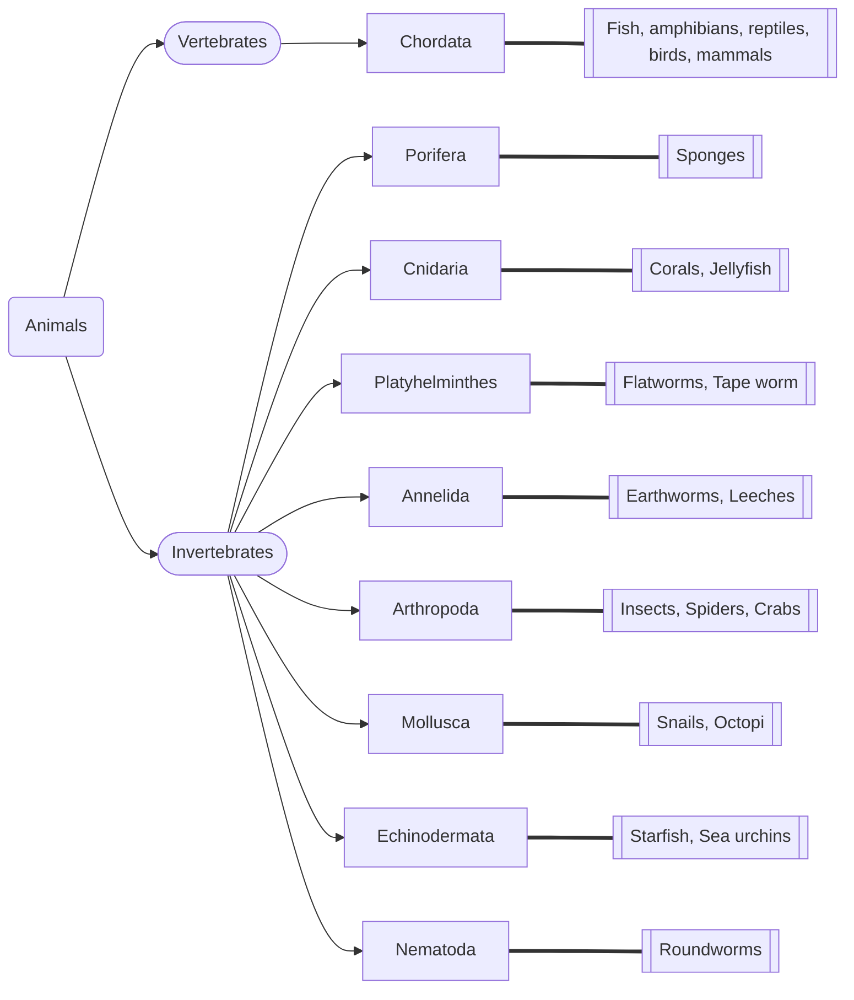

# The Kingdom Animalia
The [[Taxonomy#Kingdom|Kingdom]] animalia contains many organisms, which all have similar characteristics.  ^blurb

All animals can be divided into vertebrates and invertebrates (with and without spinal columns), which can be further divided into other [[Taxonomy#Phylum|Phyla]]. 

Scientists use [[Body Plans]] to classify animals into phyla. 