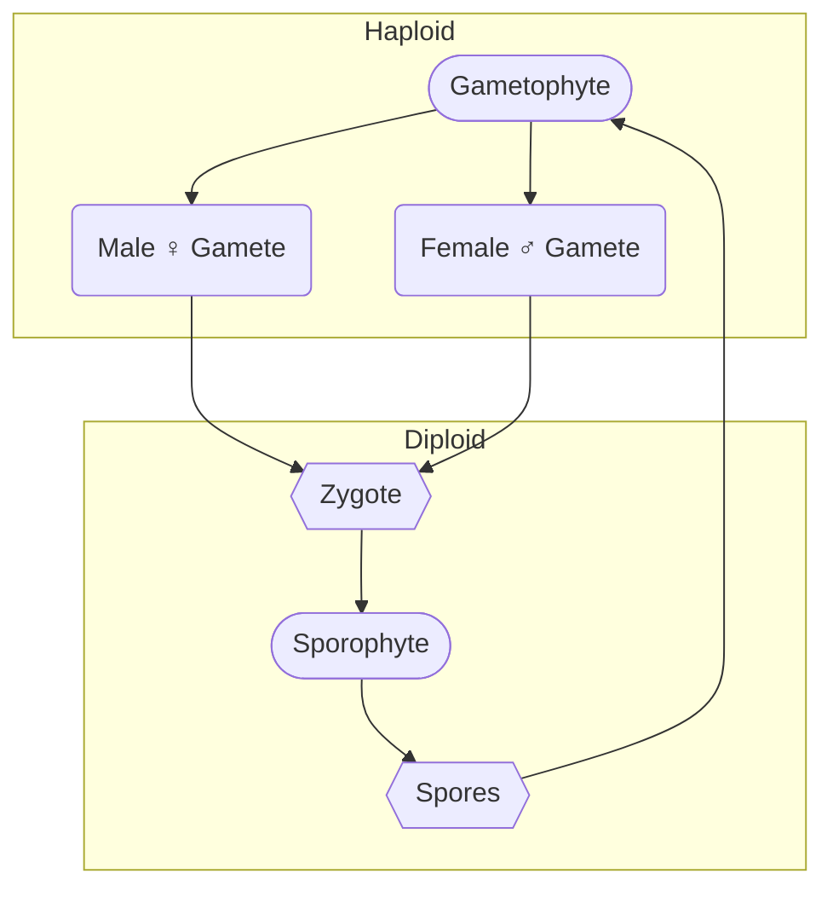

# Alteration of Plant Generations
Two definitive generations arise within plants: The Gametophyte and the Sporophyte generation. The Gamotophyte is a *sexual* generation that produces *gametes* [^1]. The sporophyte is an *asexual* generation which produces *spores* [^1]. ^blurb

[^1]: [[Reproduction]]

The two generations alternate, with one generation giving rise to the other.

