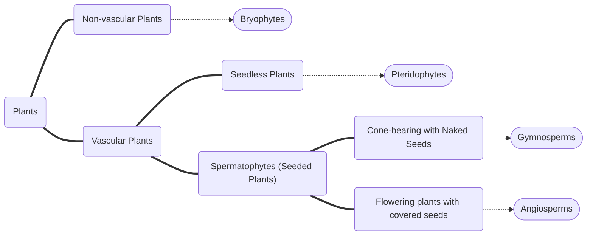

# Classification of Plants
The [[Classification|Kingdom Plantae]] is a large and diverse kingdom. Within plantae, we find 4 main groups of plants: [[Bryophytes]], [[Pteridophytes]], [[Gymnosperms]], and [[Angiosperms]]. They are classified according to the presence or absence of: Vascular tissue True stems, leaves and roots, spores or seeds, if they bear fruit, and their dependency on water for reproduction. ^blurb

## Methods of Classification
To classify plants we look at:
- Presence of vascular tissue
- Presence of true roots, stems, and leaves
- Spores or seeds
- Fruit or cone-producing
- Dependency on water for reproduction

| **Plant Type** | **Examples** | **Dominant Generation** | **Structure** | **Vascular Tissue** | **Spores or Seeds** | **Fruit** | **Dependency on water for reproduction** |
|---|---|---|---|---|---|---|---|
| **Bryophyte** | "Liverwort, mosses" | Gametophyte | Thallus - No true roots stems or leaves | Absent | Spores | None | Water needed for Fertilisation |
| **Pteridophyte** | Ferns | Sporophyte | "True roots, underground stem, large compound leaves" | Xylem and Phloem present | Spores | None | Water needed for Fertilization |
| **Gymnosperms** | Cone-bearing plants | Sporophyte | "Taproot with lateral roots, small leaves, and a woody stem" | Xylem and Phloem present | Naked Seeds | Cone-bearing | Water not needed for fertilization |
| **Angiosperms** | "Flowering Plants, monocotyledonous and dicotyledonous" | Sporophyte | "True roots, stems, and leaves as well as flowers" | Xylem and Phloem present | Covered Seeds | Fruit-bearing | Water not needed for fertilization |

### Presence of vascular tissue
Vascular plants have [[Vascular tissue|Xylem]] and [[Vascular tissue|Phloem]].

![[Vascular tissue#^xylem-blurb]]

![[Vascular tissue#^phloem-blurb]]

### Presence of true roots, stems, and leaves
Some plants have stem-like, root-like and leaf-like structures that perform the same functions but do not have the advanced structures used to classify true stem, leaves, and roots. 

### Spores or seeds
Spores and seeds are the methods that a plant uses to reproduce. Plants change between producing seeds and spores in a process known as [[Alteration of Plant Generations]]]]

### Fruit or cone-producing
[[Angiosperms]] produce fruit to cover their seeds, while [[Gymnosperms]] leave the seeds naked in cones. 

### Dependency on water for reproduction
Some plants require their sexual organs to be wet or damp to reproduce, which is what is referred to as the dependency on water for reproduction

