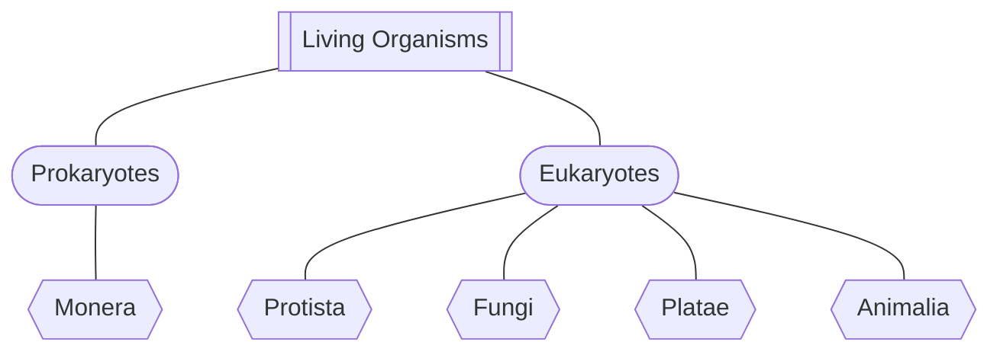

# Classification of Cells
All living organisms can be classified based on their cellular structure. This can be simpler [[#Prokaryotes]] or more complicated [[#Eukaryotes]]. ^blurb

![[Prokaryotes Vs Eukaryotes.png]]

## Prokaryotes
Prokaryotes are organisms that lack [[Nucleus|true nuclei]], and have no [[The Cell|true organelles]]. The DNA is stored within the cytoplasm within a single chromosome. Some will have non-chromosomal DNA in *plasmids*. They are smaller than $2\micro \text{m}$ and are unicellular. 

Only *Monera* are prokaryotes.

## Eukaryotes
Eukaryotes are organisms with true nuclei and organelles that occur in their cytoplasm. 
All their DNA is found within a chromosomes that occur within the nucleus. 
They are between $10 – 100 \micro \text{m}$ and are multicellular. 

*Protista, Fungi, Plantae, and Animalia* are eukaryotes.