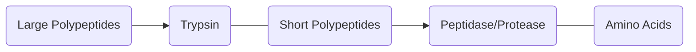
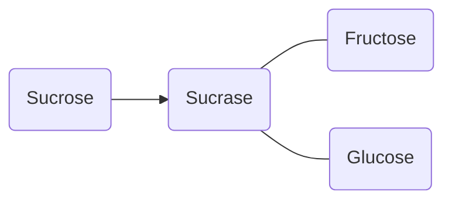
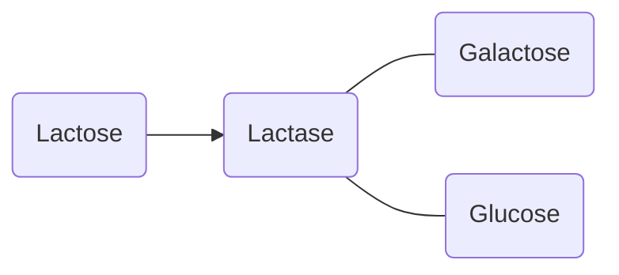
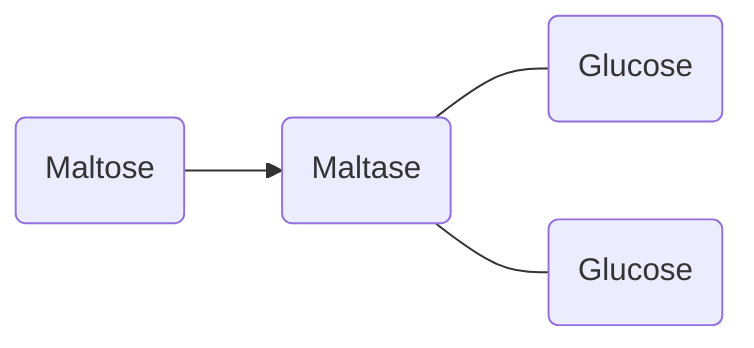
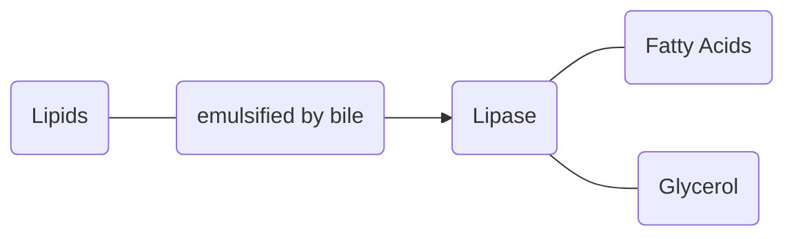

# The Small Intestine
The Small Intestine is a tube in the body that *facilitates chemical digestion*. *Soluble Nutrients* are absorbed by the *[[Villi]]* found on the *intestinal wall*. The small intestine has a pH of 8.4, which [[Life Sciences/Biochemistry/Enzymes#Denatured Enzymes|Denatures Enzymes]] from [[The Stomach#^c63229|chyme]] that is received from [[The Stomach]]. The small intestine processes the [[Carbohydrates]], the [[Proteins]] and the [[Lipids]] that are left after digestion in [[The Stomach]]. 
The small intestine is split into three regions, the Duodenum, the Jejunum, and the ileum. We only look at the Duodenum because it is where the majority of *chemical digestion and absorption* occurs. 

## The Duodenum
The Duodenum is filled with *intestinal juices* from [[The Pancreas]] and [[The Liver]]. The *pancreatic juice* contains [[Enzymes]] to breakdown [[Carbohydrates]], [[Proteins]], and [[Lipids]]. 

### [[Proteins]]
[[Proteins]] are converted from large polypeptides to short polypeptides by the enzyme trypsin. 
Short polypeptides are converted to amino acids by the [[enzymes]] peptidases/protease. 

### [[Carbohydrates]]
The Small Intestine receives Starch, and breaks it into Sucrose, Lactose, and Maltose. This is done by *pancreatic amylase* and the [[enzymes]]:
- Sucrase 
- Lactase
- Maltase

### [[Lipids]]
[[Lipids]] are large, complex structures that are hard for the body to digest. They are *hydrophobic*, and as we know all reactions involving [[enzymes]] are *hydrolysis reactions*, meaning they need water. This creates a problem, that our body solves through the use of *bile*. Bile is secreted in [[The Liver]] and stored in the gall bladder until it can be used in the small intestine. Bile *emulsifies fats*, breaking them down into smaller parts that can be digested by *lipase*. 

## Absorption of Substances
Once substances are broken down into their [[monomers]], our body can absorb them through the [[Villi]]. 
![[Villus Structure|100%]]
### Monosaccharides and Amino Acids
Monosaccharides and Amino Acids are both *water [[Solubility|soluble]]*, and they are easily absorbed by the haemoglobin in the [[Blood]]. They use *protein carriers* to actively travel against the diffusion gradient and speed up the transport into the bloodstream. From there, the absorbed substances travel through the portal vein to [[The Liver]]
### Fats
Fats are more of an issue, they are hydrophobic, meaning they cannot just be absorbed by the blood. Instead, they bind with bile salts to form micelles that are water soluble, and that can be absorbed by the *lymph capillary* to form *chyle*. From there they travel until they are later absorbed by the bloodstream. 
