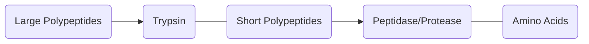
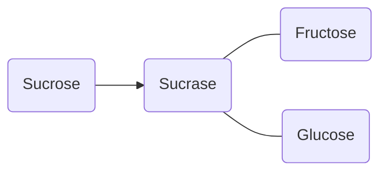
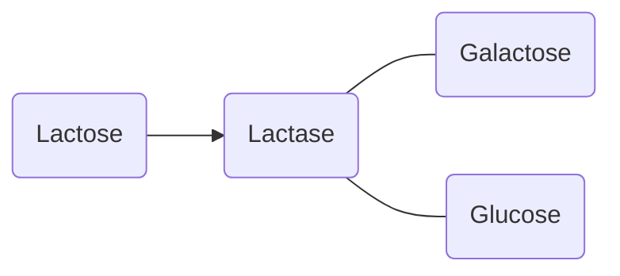
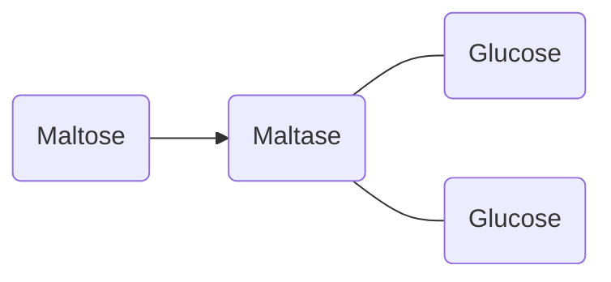
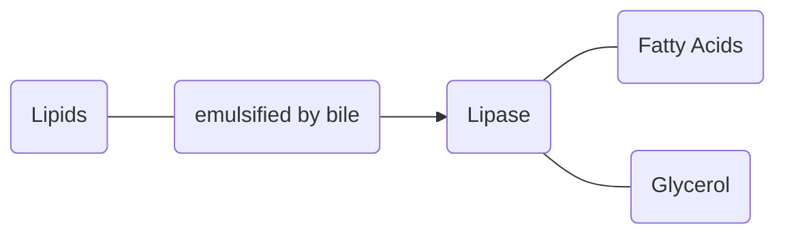

# The Small Intestine
The small intestine is where the majority of foods are [[Digestion|digested]] and [[Absorption|absorbed]]. Here, [[The Pancreas|pancreatic juice]] and *intestinal juice* mix with the [[The Stomach|acidic chyme]], changing he pH of the chyme and adding [[Enzymes]] to digest the food. The small intestine is covered in [[Villi]] to facilitate Absorption. Once the food has been fully digested and absorbed, any indigestible waste goes into [[The Large Intestine]]. 

## Structure of the Small Intestine
The small intestine is made of three parts:
- The duodenum – receives the pancreatic juice and chyme
- The jejunum – the middle part, where much absorption takes place.
- The ileum – the longest part that connects to [[The Large Intestine]].

**The Duodenum** is filled with *intestinal juices* from [[The Pancreas]] and [[The Liver]]. The *pancreatic juice* contains [[Enzymes]] to breakdown [[Carbohydrates]], [[Proteins]], and [[Lipids]]. ^duodenum

**The Jejunum** is the middle part of the small intestine.

**The Ileum** is the last and longest part of the small intestine. It connects to the large intestine through the *ileo-caecal sphincter*.

The walls of the  small intestine consist of four layers. On the outside is the [[Connective Tissues]] called the serous membrane, which connects the small intestine to surrounding tissues. Then there are longitudinal and circular [[Muscles]] to facilitate [[Muscles#^Peristalsis|peristalsis]]. Within those muscle is the submucosa and the mucosa, which contain blood vessels, lymph vessels, nerves and other glands. Lastly is the [[Villi]], which connect to the mucosa and increase the surface area for [[Absorption]] greatly. 

![[Cross Section of the Small Intestine.png]]

## Breakdown of Substances in the Small Intestine
Within the small intestine, [[Proteins]], [[Carbohydrates]], and [[Lipids]] are broken down into their monomers before being [[Absorption|absorbed]]. 

### Breakdown of Proteins in the Small Intestine
[[Proteins]] are converted from large polypeptides to short polypeptides by the enzyme trypsin. 
Short polypeptides are converted to amino acids by the [[enzymes]] peptidases/protease. 

### Breakdown of Carbohydrates in the Small Intestine
The Small Intestine receives Starch, and breaks it into Sucrose, Lactose, and Maltose. This is done by *pancreatic amylase* which contains the [[enzymes]]:
- Sucrase 
- Lactase
- Maltase

### Breakdown of Lipids in the Small Intestine
[[Lipids]] are large, complex structures that are hard for the body to digest. They are *hydrophobic*, and as we know all reactions involving [[enzymes]] are *hydrolysis reactions*, meaning they need water. This creates a problem, that our body solves through the use of *bile*. Bile is secreted in [[The Liver]] and stored in the gall bladder until it can be used in the small intestine. Bile *emulsifies fats*, breaking them down into smaller parts that can be digested by *lipase*. 

## Absorption of Substances
Once substances are broken down into their [[monomers]], our body can absorb them through the [[Villi]]. This is covered in [[Absorption|the process of absorption]]

![[Absorption]]