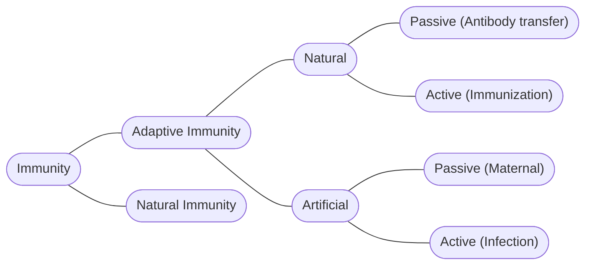

# Types of Immunity
There are 2 types of [[immunity]]: Natural and Acquired. They vary in the specificity of defense and the methods used to remove [[Microorganisms|pathogens]] and prevent diseases. ^blurb

## Natural Immunity
Naturally humans are born with some defense mechanisms to prevent diseases. They mainly focus on preventing pathogens from entering the body. Our first line of defense is the skin. It prevents most pathogens from entering the body, forcing them to go through the orifices of the body. 

When the body recognizes a foreign organism entering an orifice it will react by:
- Sneezing and Coughing to remove pathogens from [[The Trachea|airways]]
- Tears to wash the eyes and saliva to clean the mouth. 
- Mucous to trap pathogens trying to enter [[Lungs|the lungs]]
- Hairs and [[Cilia]] to trap pathogens in [[The Nose]]

Once a pathogen has breached this first layer of defence, then the body reacts by causing inflammation and fever. 

### Fever
Fever is the body increasing the temperature to [[Enzymes|denature the enzymes]] within bacteria and protists. It also decreases the rate of growth of bacteria.

### Inflammation
Inflammation is the dilation of blood vessels within the area of a wound in order to allow immune cells to reach the infection area faster. 

## Acquired Immunity
There are two types of acquired immunity: Naturally acquired immunity and Artificial Immunisation. 

### Natural Acquired Immunity. 

Acquired Immunity relies on the bodies’ [[Lymphocytes]] to react and adapt to new pathogens. This consists of the detection, destruction, and memory of pathogens. 

Every organic cell have small markers on them known as *antigens*. These allow the body to identify a cell as friend or foe. [[Antibodies]] detect these antigens and marks them as pathogens. Then the [[Blood|leukocytes]] take over with [[Lymphocytes]] and [[Phagocytes]]. Once an organism is marked as a pathogen, antibodies report it to [[Lymphocytes|B-lymphocytes]], which then multiply and produce more antibodies.

![[Lymphocytes#B-Lymphocytes]]

If the B-lymphocytes cannot prevent pathogens from entering the cells, then T-lymphocytes are enabled to kill the infected cells. 

![[Lymphocytes#T-Lymphocytes]]

#### Active and Passively Acquired Natural Immunity
*Actively acquired natural immunity* is the process above, where the body is attacked by a pathogen and creates memory B-lymphocytes. 

*Passively acquired natural immunity* comes from the mother’s placenta while humans are in the womb. Some antibodies are transferred across, and immediately create immunity to some diseases.

### Immunisation
Immunisation is the artificial process of injecting or orally exposing an organism to a pathogen. This pathogen is often dead, or artificially weakened form of a pathogen that can allow the body to create memory B-lymphocytes in order to ensure a quick response when the actual disease infects an organism. This is also known as *vaccination*.

> [!tip]- :star_struck: Extra: Diseases preventable by Vaccination 
> - Smallpox – eradicated by vaccines
> - Measles
> - Mumps
> - Rubella
> - Tetanus
> - Polio
> - Influenza
> - Yellow Fever
> - Typhoid
> - Hepatitis A and B

#### Active and passive Artificially Acquired Immunity
*Actively acquired artificial immunity* is when the body is injected with a weakened or dead form of a pathogen and has to create it’s own antibodies and memory B-lymphocytes.

*Passively acquired artificial immunity* is when the body is injected with antibodies produced in another host, which provides immediate protection against that specific pathogen. 