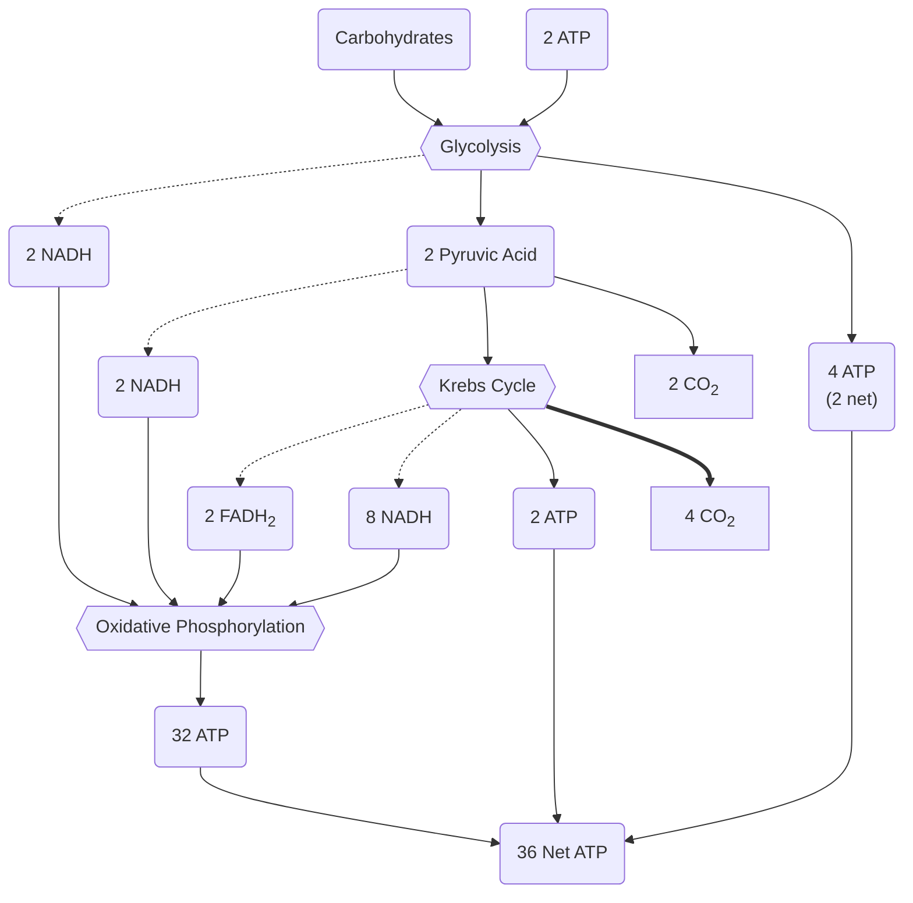

# Cellular Respiration
 Cellular respiration is the method used by [[The Cell|Cells]] to gain energy to do work with. Most [[Characteristics of Life|life processes]] need some form of energy to occur. ^blurb

> [!definition]
> **Respiration**: The catabolic process of breaking down organic compounds that results in the gradual release of energy that is stored in ATP molecules. 
> 
> Oxygen is required and Carbon Dioxide and Water are released as waste products. 
> 
> **Chemical Formula**:
> $$
> C_6H_12O_2 + O_2 \textrm{ –enzymes→ } CO_2 + H_2O + ATP
> $$
^definition

Energy produced by cellular respiration is used for:
- Growth
- [[Mitosis|Cell Division]]
- [[Nutrition in Animals#Digestion|Digestion]]
- Movement
- [[The Circulatory System|Transport of substances]] in the body
- [[Osmosis]] in the body

## Requirements for Cellular Respiration
- [[Carbohydrates|Glucose]]
- Oxygen
- Mitochondria

### The Mitochondrion
The mitochondrion is the [[The Cell|organelle]] responsible for cellular respiration. 

![[Mitochondria]]

## Products of Cellular Respiration
- Carbon Dioxide
- Water
- [[ATP]]

## Stages of cellular respiration
There are three stages of cellular respiration:
- [[#Glycolysis]]
- [[#Krebs Cycle]]
- [[#Oxidative Phosphorylation]]
  
### Glycolysis
Glycolysis is an anaerobic process that occurs in the cytosol outside the mitochondria. During glycolysis carbohydrates are broken into *Pyruvic Acid* and energy-rich *Hydrogen Atoms*, with some energy going into [[ATP]]. [[Enzymes|Coenzymes]] then carry the $H$ Atoms into the mitochondria where they are used in [[#Oxidative Phosphorylation]]. 

### Krebs Cycle
The krebs cycle is an aerobic process that occurs in the matrix of the mitochondrion. It is a cyclical process in which Pyruvic acid enters the mitochondrion, undergoes chemical processes, and releases $H$ atoms and $CO_2$ molecules. 
[[Enzymes|Coenzymes]] then carry the $H$ atoms to the cristae where they are used in [[#Oxidative Phosphorylation]]. 

### Oxidative Phosphorylation
Oxidative Phosphorylation is an aerobic process that occurs on the cristae of the mitochondrion. In this process energy-rich $H$ atoms are transferred between *Hydrogen acceptors*, releasing energy each time. This energy is stored in ATP. The final hydrogen acceptor is oxygen, and two $H$ atoms combine with oxygen to form water as a biproduct. 

## Aerobic vs Anaerobic Respiration
Anaerobic respiration does not require oxygen. Only [[#Glycolysis]] takes place, resulting in the glucose being not fully broken down and less energy being released. 

> [!summary]+ Aerobic vs Anaerobic
> Similarities:
> - Both use glucose as a raw material
> - Both produce energy & $CO_2$
> - Both are controlled by enzymes

Differences:

| Topic                  | Aerobic                     | Anaerobic                                          |
| ---------------------- | --------------------------- | -------------------------------------------------- |
| Oxygen                 | Oxygen present              | Oxygen absent                                      |
| Products               | $CO_2$, water               | Lactic acid (animals), $CO_2$ and ethanol (plants) |
| Energy Release         | Large amount of energy      | Small amount of energy                             |
| Carbohydrate breakdown | Full breakdown              | Partial Breakdown                                  |
| Location               | In Cytosol and Mitochondria | Only in Cytosol                                    |

### Aerobic Respiration
During aerobic respiration, one carbohydrate is fully broken down into a total of 38 APT (36 net ATP). This is a far more efficient process than [[#Anaerobic Respiration]], however it requires more Oxygen. If the body cannot provide this oxygen then the cell begins to anaerobically respire. 

Aerobic respiration only occurs in the presence of oxygen, and it produces both $CO_2$ and $H_2O$, as well as a large amount of energy. This is because it completely breaks up a glucose molecule. It takes place inside the cytosol and the mitochondrion

The full process of aerobic respiration is as follows:

It consists of:
- [[#Glycolysis]]
- [[#Krebs Cycle]]
- [[#Oxidative Phosphorylation]]

### Anaerobic Respiration
During anaerobic respiration, only glycolysis takes place. The pyruvic acid produced is converted into *lactic acid* in animals or *carbon dioxide and alcohol* in plants. 

#### Anaerobic Respiration in Animals
In animals, when muscle cells respire anaerobically they produce lactic acid. This is because only glycolysis takes place, and pyruvic acid is not fully broken down. 

**Lactic acid** is the toxin that leads to muscle stiffness and pain. To convert lactic acid back to pyruvic acid, oxygen is needed. This oxygen needed is known as *oxygen debt*. To reduce oxygen debt, moderate exercise with deep breathing will allow the body to convert lactic acid back into pyruvic acid, and then into more ATP. 

#### Anaerobic Respiration in Plants
In plants, when cells don’t get enough oxygen they produce alcohol and carbon dioxide. This is because only glycolysis takes place and pyruvic acid is not fully broken down. 

Plants produce alcohol and carbon dioxide because they break down the pyruvic acid further if it is not processed. This is known as alcoholic fermentation, and it has many applications within the industrial world. 

Yeast and other fungi that respire anaerobically is used to create products like beer, wine, and bread. Some bacteria are also used for cheese, yoghurt, and sour milks. 

> [!note] Industrial Application of Alcoholic Fermentation: Beer
> Beer takes barley, water, hops, and yeast. 
> 1. The barley is soaked in water til it germinates, which are then finely chopped to create malted barley. 
> 2. Malted barley, hot water, and sugar are all mixed together to create a sweet syrup known as wort. 
> 3. The wort is mixed with hops and boiled. This creates the flavour of beer. 
> 4. The yeast, is then added to the mixture, which is left to ferment creating alcohol and $CO_2$.
> 5. This process takes about two weeks, after which the mixture is bubbly and alcoholic. 
> 6. Everything is then filtered out and the remaining liquid is cooled to create the beer. 

