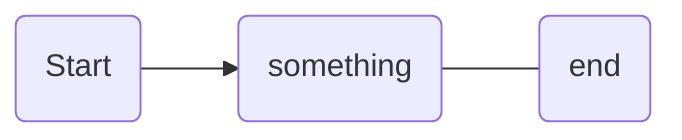

#GR10 #personal/learning 

# Heading 1

## Heading 2

### Heading 3

#### Heading 4

##### Heading 5

###### Heading 6


the quick brown fox jumps over the lazy dog
THE QUICK BROWN FOX JUMPS OVER THE LAZY DOG

**Bold** and *italic* and ~~strikethrough~~ and ==Highlight== 

- Hello World!
	- Hello World!
		- Hello World!

- [ ] To Do
- [x] To-Do

> **block quote**
> hello world!


> [!none] Callout
> 
> hello world!

Maths:
$$ 1 + 2 = 3 $$
Code:
```java
System.out.println("Hello World");
```
Flowchart:

