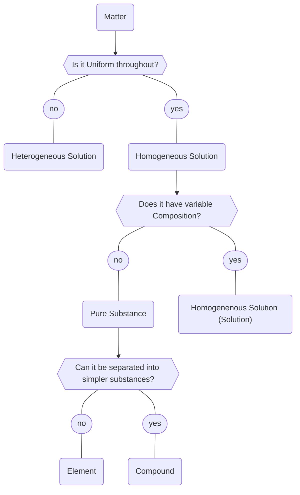

# Classification of Matter

There are many ways that matter can be classified: 
- Classification by mixture type
- Classification by properties
- Classification of elements

## Classification by Mixture Type

Homogeneous solutions are mixtures with compounds that are fully [[Solubility|soluble]]. 

In heterogeneous solutions, the materials may [[Diffusion|diffuse]] through the 

### Pure Solutions
Pure substances consist of only one type of substance, which can either be an element or a compound. 

#### Elements
Elements cannot be broken down into smaller substances. They are made of only one type of [[Atoms|Atom]]. Elements are depicted in the [[Periodic Table.png]].  

#### Compounds
Compounds can be broken down into smaller substances. Compounds are made up of different elements that have [[bonding|bonded]] together to form new compounds. They are made of many types of [[Atoms|atoms]] that are [[Stoichiometry|bound together in fixed ratios]]. Chemical processes may break these down into other elements. 

### Types of Mixtures
We study two types of mixtures in physics:
- [[Heterogeneous Solution]]
- [[Homogeneous Solution]]

![[Heterogeneous Solution]]

![[Homogeneous Solution]]

#### Separating Mixtures
We can split mixtures through:
- Filtration
- Evaporation
- Separating Funnels
- Distillation
- Chromatography
- Sorting
- Magnetic Separation

## Other Properties of Matter
- Strength
	- Compressive Strength 
	- Tensile Strength
- Thermal and [[Electrical Circuits|Electrical Conductivity]]
	- See [[Conductors and Insulators]]
- Brittleness, Malleability, and Ductility
	- **Brittle**: Break easily when force is applied
	- **Malleability**: Will deform when force is applied without necessarily breaking
	- **Ductility**: Can be stretched into wires 
- [[magnetism]]
- [[Density of Atoms|Density]]
- [[Melting Point|Melting and Boiling Point]]

## Classification of elements
We can classify Elements as *metals, metalloids, and non-metals*. Each one have certain properties that define them. 

### Metals
**Melting Points**: Metals are solids at room temperature. They have high melting points, but all metals will eventually melt. 

**Strength**: Metals are compressively strong and has tensile strength

**Conductivity**: Good [[Conductors and Insulators|conductors]] of heat and electricity

**Malleability**: Malleable and Ductile

**Colour**: Shiny, grey-ish or golden or coppery

> [!note]+ :spiral_notepad: Mercury: The liquid metal
> 
> There is one exception to metals being solid at room temperature: Mercury. It is a liquid at room temperature, and will remain liquid until cooled to $-38,83 \degree C$

### Metalloids
Metalloids share properties of metals and non-metals. They tend to share more properties with non-metals than metals, 

### Non-Metals
**Melting Points**: Solid or gasses at room temperature. Regular non-metals are hasses with low melting and boiling points, while [[Covalent Bonding#Giant Covalent Structures|network structures]]. 

**Density**: Low densities

**Conductivity**: [[Conductors and Insulators|insulators]] of heat and electricity

**Malleability**: Brittle when solid

**Colour**: Dull surface; various colours. 

> [!note]+ :spiral_notepad: Bromine: The liquid non-metal
> 
> There is one exception to non-metals being solid or gaseous at room temperature: Bromine is a liquid at room temperature. 

> [!note]+ :spiral_notepad: The electrically conductive Non-metal: Graphite
> 
> Graphite is electrically conductive

> [!note]+ :spiral_notepad: Thermally Conductive non-metals: Diamond and Graphite
> 
> Graphite and diamond are both conductive non-metals. Diamond is actually the best thermally conductive element. 