# Stoichiometry
Stoichiometry is the relationship between the quantities of substances in a reaction. 

We look at:
- Mass, [[Mole|Molar mass]], and the [[Mole]]
- Concentration, Volume, and the [[Mole]]
- Number of Particles, [[Avogadro's Number]], and the [[Mole]]
- Volume, Molar volume, and the [[Mole]]. 

We can use *balances chemical formulas* to work out these substances, as the chemical formula shows us the *mole ratio* of substances. 

> [!example] 💡 Eg. 
>
> The formula: ==4H2 + O2 → 2H2== O means that:
> 
> For every mole of *2H2O* there is *4 H2* mole and *1 O2* mole
> 
> We can also state this as: 4 : 1 : 2 = H2 : O2 : H2O

This becomes very useful when we try to convert between different amounts of substances. We can use formulas that dictate the relationship between the number of moles and other quantities to convert from one quantity to another, even across chemical reactions. 

This means we can take the mass of our reactants, convert it into moles, and then use the molar ratios to find the amount of moles in our product. From there we can find the mass, number of particles, volume, or concentration of our product. These relationships are shown in this diagram:

```mermaid
flowchart LR

id1(mol A) -- molar Ratio --- id2(mol B)

id3([Mass]) -- n = m/M ---id1
id4([Particles]) -- n = N/N<sub>A</sub> ---id1
id5([Volume]) -- n = V/V<sub>M</sub> ---id1
id6([Concentration]) -- "n = c · V" ---id1

id2 -- "m = n · M " --- id7([Mass])
id2 -- "N = n · N<sub>A</sub>" --- id8([Particles])
id2 -- "V = n · V<sub>M</sub>" --- id9([Volume])
id2 -- "c = n/V" --- id10([Concentration])

```

## Conversion Formulas
### Mass
$$ 
\begin{align}
\\& n = \frac{m}{M}
\\& \textrm{Where:}
\\& n = \textrm{moles } (mol)
\\& m = \textrm{mass } (grams) 
\\& M = \textrm{Molar Mass } (g.mol^-1)
\end{align}
$$
### Particles
$$ 
\begin{align}
\\& n = \frac{N}{N_A}
\\& \textrm{Where:}
\\& n = \textrm{Moles } (mol)
\\& N = \textrm{Particles } (particles) 
\\& N_A = \textrm{Avogadro's Constant } (6.02 \times 10^{23})
\end{align}
$$
### Volume
$$ 
\begin{align}
\\& n = \frac{V}{V_m}
\\& \textrm{Where:}
\\& n = \textrm{Moles } (mol)
\\& m = \textrm{Volume } (dm^3) 
\\& V_m = \textrm{Molar Volume } (22.4 dm^3)
\end{align}
$$
### Concentration
$$ 
\begin{align}
\\& n = c \times V
\\& \textrm{Where:}
\\& n = \textrm{Moles } (mol)
\\& c = \textrm{Concentration } (mol.dm^{-3}) 
\\& V = \textrm{Volume } (dm^3)
\end{align}
$$

## Steps to Stoichiometry
1. Balance your Equation – always check it is balanced
2. Convert given information into moles
3. Find the Molar Ratio between the given substance and the substance you are trying to calculate
4. Convert moles of the substance you are trying to calculate into the wanted unit

> [!example]+ 💡 Example
> 
> 2H20 → 2H2 + 02
> 
> 14g of O2 reacts with hydrogen. Find out the mass of H2 will react to form 2H2O
> 
> Given: Mass of O2 (14g)
> 
> Needed: Mass of H2 
> 
> $$\begin{align*}
\\ \textrm{Finding Moles of } O_2 \textrm{: } & n = \frac{m}{M} → n = \frac{14}{2(16)} = 0.4375 mol
\\&
\\ \textrm{Finding Molar Ratio: } & 2H_2 : O_2 = 2 : 1
\\& 2:1 = n_{H_2} : n_{O_2} \\& 2:1 = n_{H_2} : 0.4375mol
\\& n_{H_2} = 0.875mol
\\ \textrm{converting to mass: } & m = n(M) → m = 0.875(2) = 1.75g
\end{align*}$$